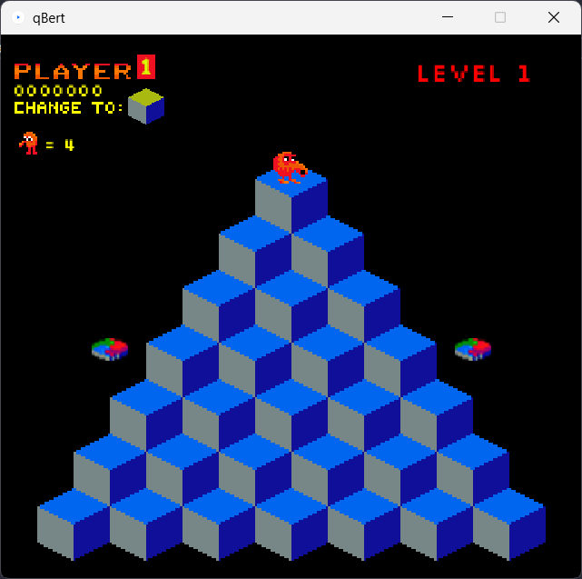

# Q*bert

## Disclaimer
This is a replica of Qbert developed for nonprofit educational purposes only. All intellectual property rights of the original game belong to the respective manufacturers. This replica was created to demonstrate and study the game mechanics and design principles. Note that the MIT license applies only to code developed by the creator of this game replica and not to any elements directly derived from the original Qbert game.

## Dependencies
- Processing v.3 or higher
- Processing sound management library.

## Commands
- To move use the keys: WASD.
- To go ahead use the key: Enter.
